---
format:
  revealjs:
    incremental: false
    css: ../styles.css
execute: 
  echo: true
---

# Day 1: Guidance

## Instructor: Joel Nitta

:::: {.columns}

::: {.column width="50%"}
- Research topic 1: Ecology and evolution of **ferns**

- Research topic 2: Development of software for **data science**
  - [Reproducible data analysis](https://syllabus.gs.chiba-u.jp/2024/101101101076000/Z011531301/en_US), Thursdays 3rd period

- <https://www.joelnitta.com>
:::

::: {.column width="50%"}
{fig-alt="Image of Joel Nitta in field" height="450"}
:::

::::

## Instructor: Joel Nitta

:::: {.columns}

::: {.column width="50%"}

- Born and raised in California

- Fourth generation Japanese-American

- First came to Japan as high school exchange student
:::

::: {.column width="50%"}
{fig-alt="Image of California map" width="100%" height="100%"}
:::

::::

## Why plants? Why botany?

- Discuss with your neighbor **why plants matter**

## Why plants?

- Food to eat
- Fiber for clothing
- Building materials for houses
- Paper for books
- Drugs for medicines
- Oxygen to breath
- Basis of the food chain
- Mental well-being

---

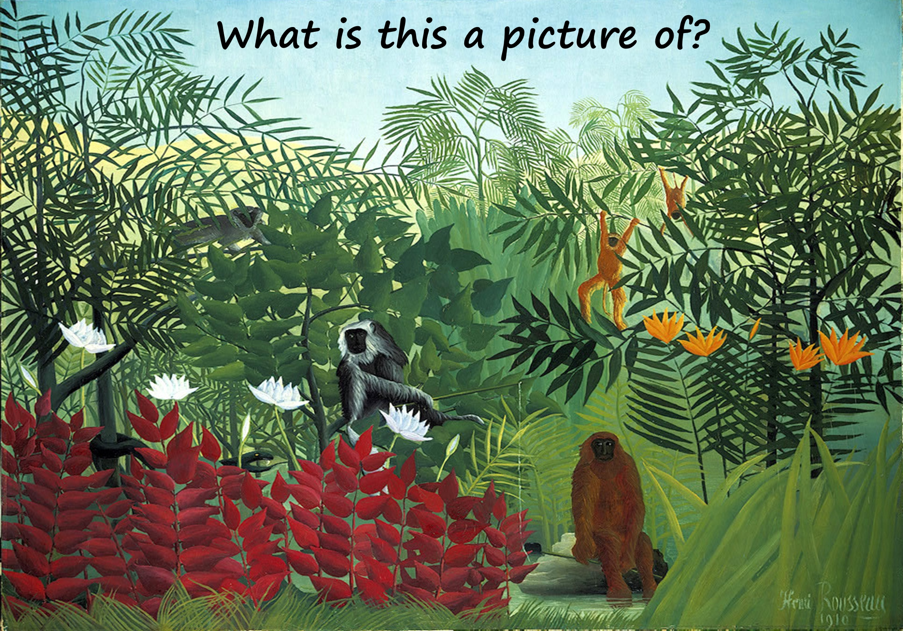

. . .

- Do you notice the plants around you? Why or why not?

## Why botany?

- Botany helps us **organize** plant diversity and **understand how plants evolved** (and are evolving)

## Goals of this course

By the end of the course, you should be able to:

- Understand the basic plant body plan and composition of a plant cell
- Explain the defining characteristics of the major lineages of land plants and how they are related to each other
- Explain how plants are distributed on earth to form ecosystems and biomes

## Language

- The class is conducted **in English**.

- If needed, you may ask questions in Japanese and I will explain in Japanese.

- However, you need to be able to communicate in English and understand the lecture materials and textbook content as provided in English.

- If the English level of the class is too high, consider taking a different course.

## AI Policy

- AI is allowed on a **limited basis**, to assist you with the coursework, **not to do it for you**

- For example, after writing the first draft of the weekly assignment on your own, you may use AI to help correct your English grammar and spelling

- Usage of AI to generate the main content of any assignment is prohibited and will receive **zero points**

- Bottom line: you are spending time and money **to learn**. **Letting AI do everything is cheating yourself.**

## Textbook

:::: {.columns}

::: {.column width="50%"}
**"Let's Botanize"** by Ben Goulet-Scotta and Jacob S. Suissa.

Digital version available on <https://amazon.co.jp> for approx. 1,700 JPY. 

The textbook is **required** for all students.
:::

::: {.column width="50%"}
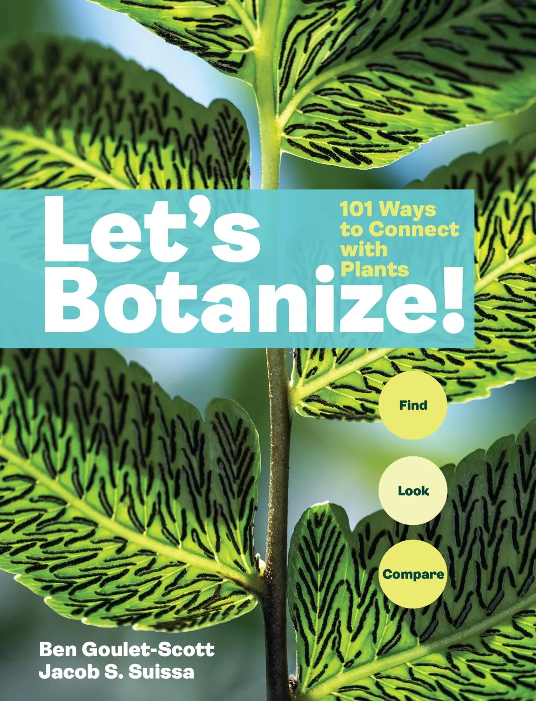
:::

::::

## Textbook

:::: {.columns}

::: {.column width="50%"}
- This is not a traditional textbook.
- The goal of the book is to **help you observe plants**
- Each chapter starts with a prompt
- The reader goes outside and **observes plants that fit the prompt**
:::

::: {.column width="50%"}
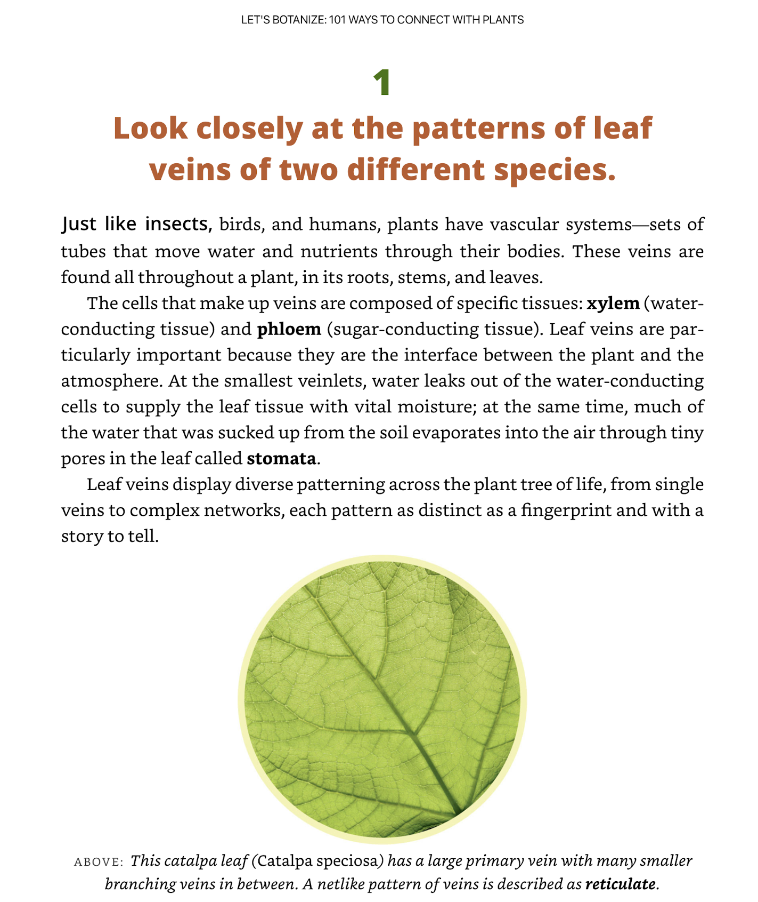{}
:::

::::

## Weekly assignment

- Starting from week 2, you will answer **two prompts** from the book each week by **observing plants outside of class**
- When you make an observation, take a picture of the plant and post it on iNaturalist (more on that soon)
- You must submit the observation notes (including explanation, photos, and iNaturalist link) **by the time class starts (12:50 PM)**
- During class, you will choose one of your answers to share with the other students and discuss

## Example assignment

## On-demand lecture

- There is one on-demand lecture (topic: Phylogenetic Analysis)

- The on-demand lecture will be posted next week

- The content of the on-demand lecture will appear on the midterm test, so be sure to **watch it as soon as possible**

## Midterm Test

- There will be an in-class midterm test on 2026-07-07
  - Content includes Weeks 2, 3, and 4 plus the on-demand lecture

- The test will be administered online (Moodle)
  - Be sure to bring a laptop computer to take the test

- You may use one page of **hand-written** notes during the test (A4, both sides). **No other materials are permitted during the test.**

## Absence policy

- **No late assignments will be accepted**, and no points will be given for discussion in case of absence.

- Make-up assignments will only be given in cases of documented medical reasons or family emergencies.

# iNaturalist

## About iNaturalist

:::: {.columns}

::: {.column width="40%"}
- App for **citizen science**
- Allows anybody to easily document the species around them, **even if they are not specialists**
- "Real-life Pokémon"
:::

::: {.column width="60%"}

:::

::::

## Installation

```{r}
#| echo: false
library(qrcode)
qr_code("https://apps.apple.com/us/app/inaturalist/id6475737561") |>
  generate_svg(
    here::here("day1/inat-mac-app-qr.svg"),
    background = "transparent",
    show = FALSE
  )

qr_code(
  "https://play.google.com/store/apps/details?id=org.inaturalist.android"
) |>
  generate_svg(
    here::here("day1/inat-google-app-qr.svg"),
    background = "transparent",
    show = FALSE
  )
```

::: {.columns}
::: {.column}


Apple
:::
::: {.column}


Google
:::
:::

## Setting up your account

- Feel free to choose any username you like (it does not have to be your real name)
- Set all of the data sharing options to **"on"**

## Identifying Species with iNaturalist

:::: {.columns}

::: {.column width="50%"}
- Open iNaturalist
- "Me": A list of your observations so far
- "+": Add a new observation
:::

::: {.column width="10%"}
:::

::: {.column width="40%"}
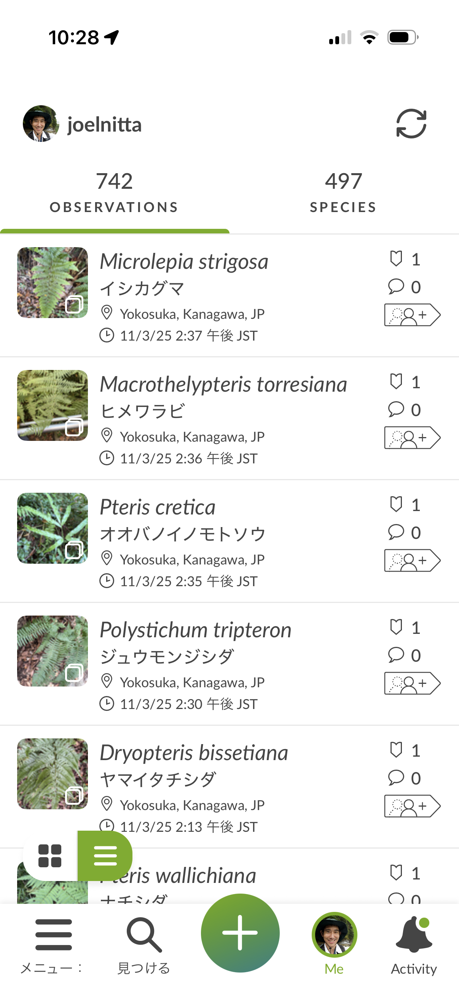{height="600px"}
:::

::::

---

:::: {.columns}

::: {.column width="50%"}
- Tap "+"
:::

::: {.column width="10%"}
:::

::: {.column width="40%"}
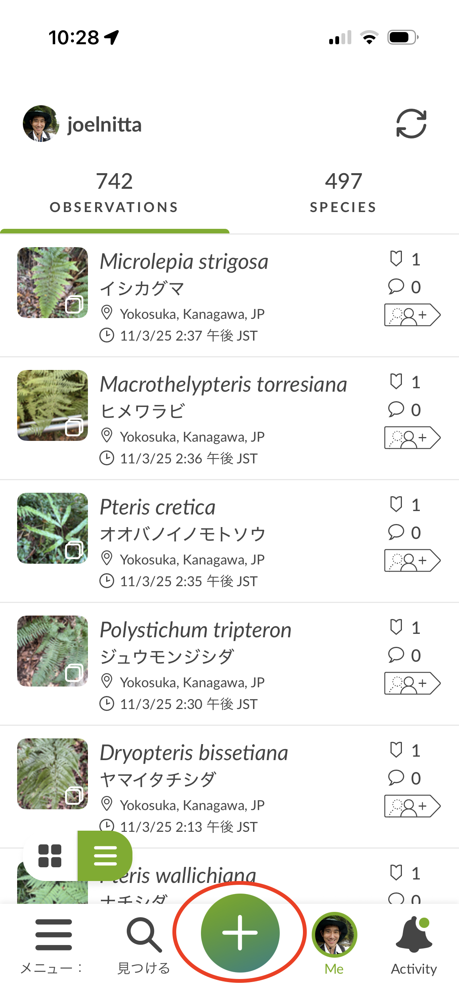{height="600px"}
:::

::::

---

:::: {.columns}

::: {.column width="50%"}
- Tap "+" → "Camera"
:::

::: {.column width="10%"}
:::

::: {.column width="40%"}
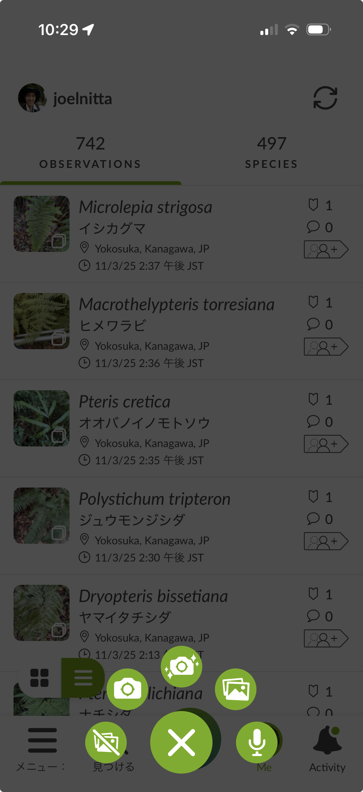{height="600px"}
:::

::::
---

:::: {.columns}

::: {.column width="50%"}
- Tap "+" → "Camera"
:::

::: {.column width="10%"}
:::

::: {.column width="40%"}
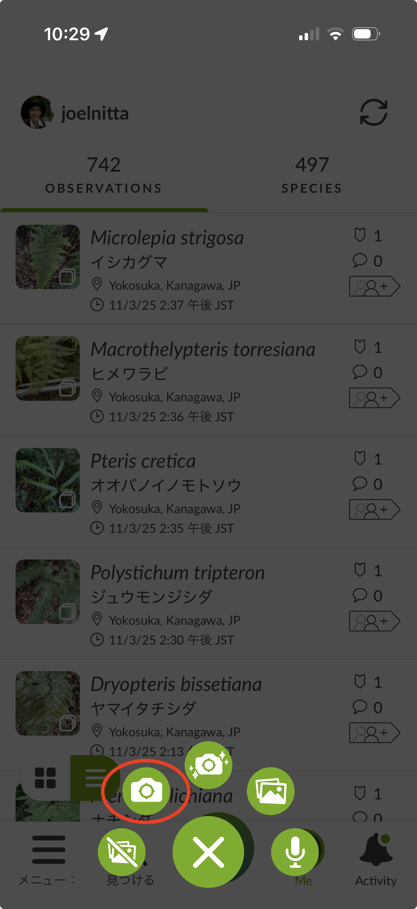{height="600px"}
:::

::::

---

:::: {.columns}

::: {.column width="50%"}
- Take a photo
  - As close and as clear as possible
  - Flowers or other reproductive structures are helpful (but not required)
:::

::: {.column width="10%"}
:::

::: {.column width="40%"}
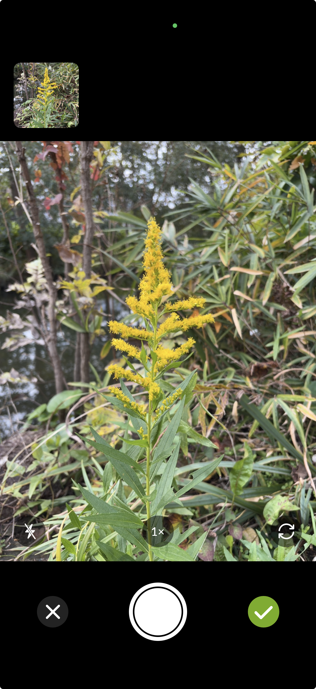{height="600px"}
:::

::::

---

:::: {.columns}

::: {.column width="50%"}
- Take a photo
  - As close and as clear as possible
  - If other organisms (such as plants) are visible in the background, the algorithm may become confused
  - Flowers or other reproductive structures are helpful (but not required)
:::

::: {.column width="10%"}
:::

::: {.column width="40%"}
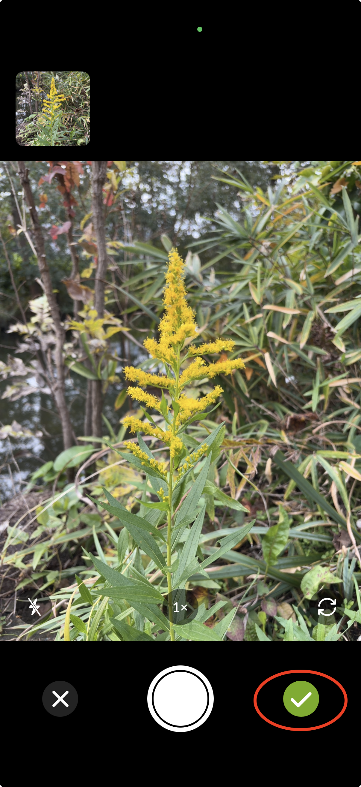{height="600px"}
:::

::::

---

:::: {.columns}

::: {.column width="50%"}
- Choose a species: tap "ID with AI"
:::

::: {.column width="10%"}
:::

::: {.column width="40%"}
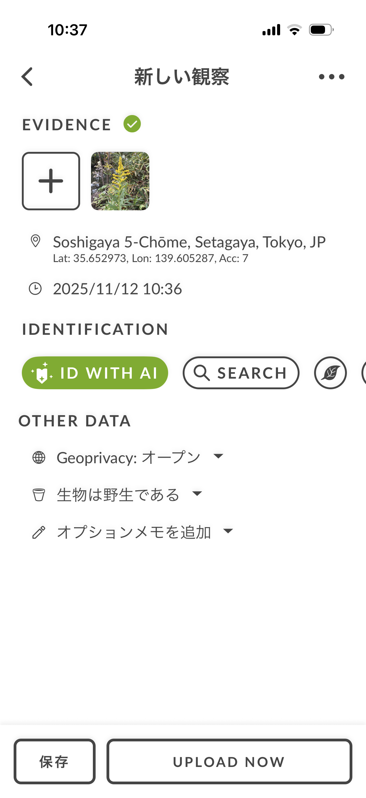{height="600px"}
:::

::::

---

:::: {.columns}

::: {.column width="50%"}
- Choose a species: tap "ID with AI"
:::

::: {.column width="10%"}
:::

::: {.column width="40%"}
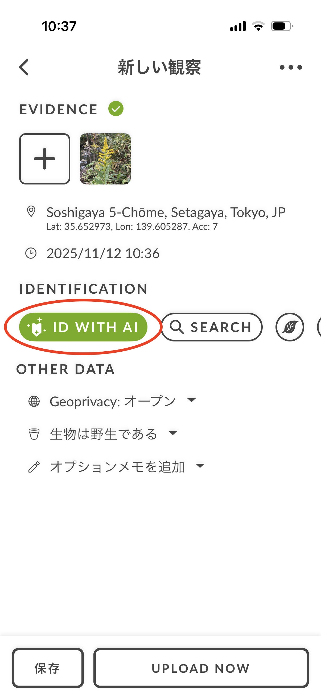{height="600px"}
:::

::::

---

:::: {.columns}

::: {.column width="50%"}
- The most likely species appears at the top
- Other possible species appear below
- Before selecting one of the lower-ranked species, check its information
  - Tap 
:::


::: {.column width="10%"}
:::

::: {.column width="40%"}
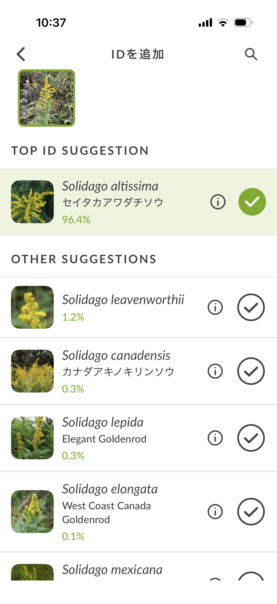{height="600px"}
:::

::::


---

:::: {.columns}

::: {.column width="50%"}
- The most likely species appears at the top
- Other possible species appear below
- Before selecting one of the lower-ranked species, check its information
  - Tap 
:::


::: {.column width="10%"}
:::

::: {.column width="40%"}
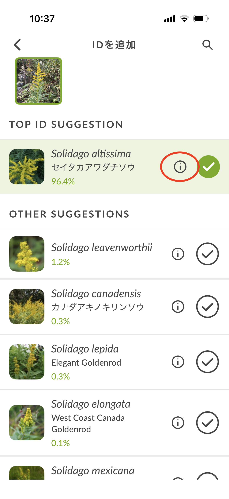{height="600px"}
:::

::::

---

:::: {.columns}

::: {.column width="50%"}
- Photos and a distribution map for the candidate species are displayed
- Look carefully at the photos and decide whether it is **the same organism as the one in front of you**
  - You can swipe left and right through the candidate photos
:::

::: {.column width="10%"}
:::

::: {.column width="40%"}
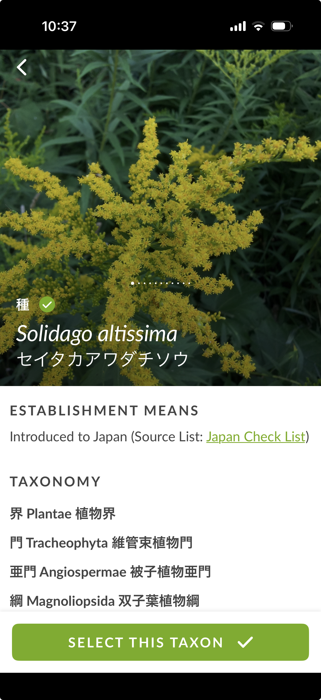{height="600px"}
:::

::::

---

:::: {.columns}

::: {.column width="50%"}
- Photos and a distribution map for the candidate species are displayed
- Look carefully at the photos and decide whether it is **the same organism as the one in front of you**
  - You can swipe left and right through the candidate photos
:::

::: {.column width="10%"}
:::

::: {.column width="40%"}
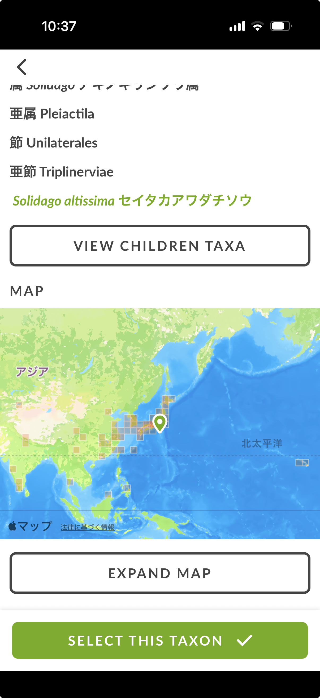{height="600px"}
:::

::::

---

:::: {.columns}

::: {.column width="50%"}
- **Once you have confirmed the species**, tap<br>"Select this taxon"
:::

::: {.column width="10%"}
:::

::: {.column width="40%"}
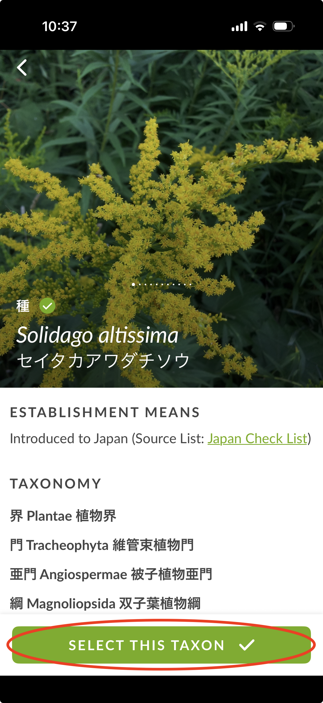{height="600px"}
:::

::::

---

:::: {.columns}

::: {.column width="50%"}
- Or, if you think "Actually, that's not it," tap "<" and look at the other candidates
:::

::: {.column width="10%"}
:::

::: {.column width="40%"}
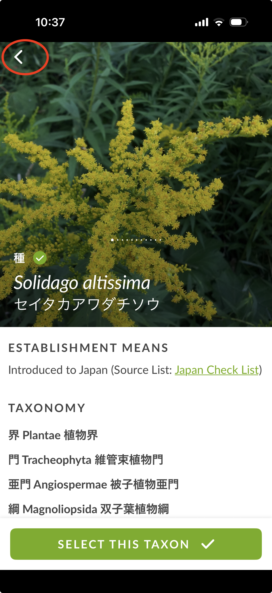{height="600px"}
:::

::::

---

:::: {.columns}

::: {.column width="50%"}
- It's **okay** if you can't identify it to species!
- It's **okay** even if you're not very confident in the identification!
:::

::: {.column width="10%"}
:::

::: {.column width="40%"}
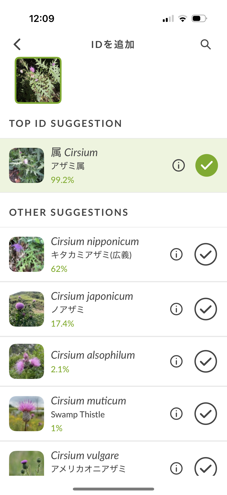{height="600px"}
:::

::::

---

:::: {.columns}

::: {.column width="50%"}
- The other settings are usually fine as they are
- Set **"Captive/Cultivated"** for obviously planted plants, pets, etc.
- If you don't want to show the exact location (for example, your house), change the **Geoprivacy** setting
:::

::: {.column width="10%"}
:::

::: {.column width="40%"}
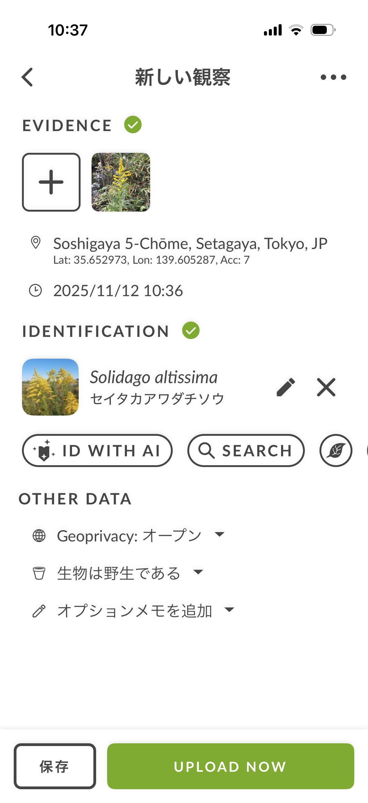{height="600px"}
:::

::::

---

:::: {.columns}

::: {.column width="50%"}
- The other settings are usually fine as they are
- Set **"Captive/Cultivated"** for obviously planted plants, pets, etc.
- If you don't want to show the exact location (for example, your house), change the **Geoprivacy** setting
:::

::: {.column width="10%"}
:::

::: {.column width="40%"}
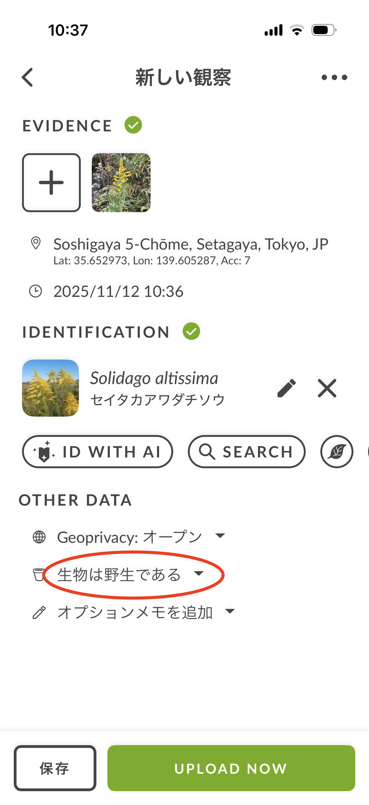{height="600px"}
:::

::::

---

:::: {.columns}

::: {.column width="50%"}
- The other settings are usually fine as they are
- Set **"Captive/Cultivated"** for obviously planted plants, pets, etc.
- If you don't want to show the exact location (for example, your house), change the **Geoprivacy** setting
:::

::: {.column width="10%"}
:::

::: {.column width="40%"}
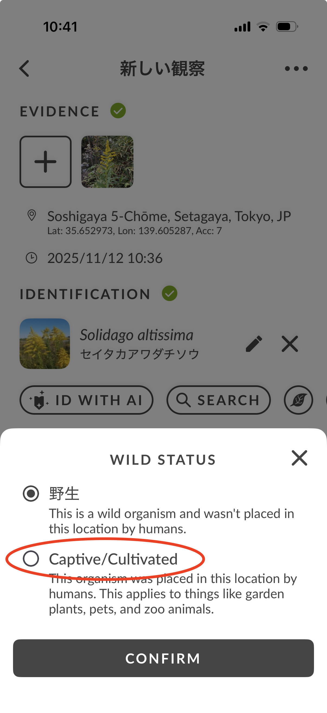{height="600px"}
:::

::::

# A (very) brief history of plant life on earth

## Next week's assignment: Plant Morphology

- Prompts
  - 5: Can you find the growing tip of a root?
  - 9: Compare a flower with fused petals to one with separate petals.
  - 16: Can you find the patterns of nodes repeated along a branch?
  - 28: Look for outgrowths where a young leaf attaches to a stem.
  - 29: Can you find a scar on a branch where a leaf used to be attached?